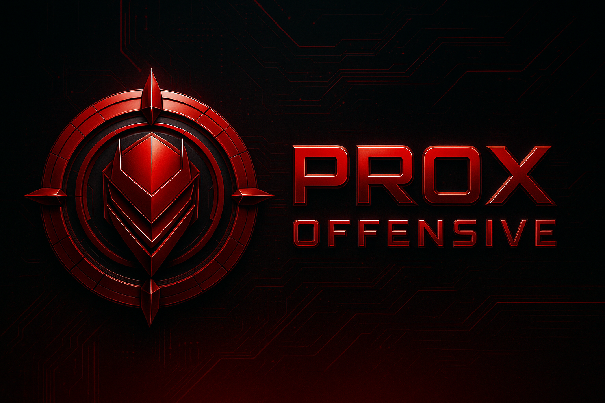

  

# Felix Gutierrez  
🔹 Offensive Security | AI-Augmented Recon | Builder of Tools & Beats  
🧠 aka **Prox** | 🎭 aka **Don Trabajo**

Hi, I’m Felix — a red team recon specialist, ethical hacker, and lifelong creative.

As **Prox**, I focus on real-world offensive security: building tools, auditing attack surfaces, and integrating AI workflows into practical InfoSec ops. My current work includes the [Prox Offensive Recon Toolkit](https://recon.proxoffensive.com), custom GPT assistants, and OSINT enrichment pipelines.

As **Don Trabajo**, I’m a musician and storyteller, blending Afro-Latin roots, brujería mysticism, and Bronx-born rhythm into sound. The same spirit that drives my music fuels my hacking — pattern recognition, improvisation, and flow.

I created **Prox Offensive Information Security** to bring these worlds together — where code meets culture, and creativity meets discipline.

---

### 🔧 Projects & Interests:
- 🛠️ Recon Toolkits for red teams & freelancers  
- 🤖 GPT-powered InfoSec assistants  
- 🌐 AI-augmented OSINT workflows  
- 🎶 Experimental music & digital rituals

---

> Want a free recon audit on your personal or company domain?  
> 👉 [Visit recon.proxoffensive.com](https://recon.proxoffensive.com)  
> 📫 Reach me at felix.gutierrez@proxoffensive.com

---

🫱🏻‍🫲🏽 Let’s build something real.
